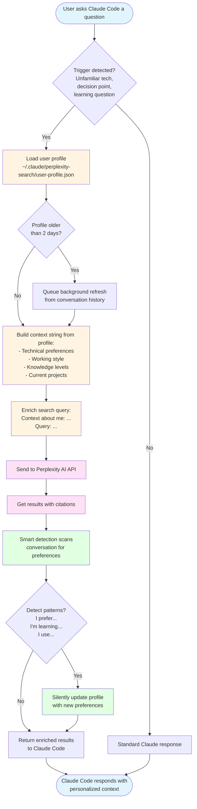

# Perplexity Search MCP for Claude Code

An MCP server that provides Perplexity AI search with personalized context enrichment for Claude Code.

## Features

- **Personalized Search**: Enriches queries with your technical preferences, working style, and knowledge levels
- **Automatic Profile Updates**: Silently detects and updates your profile when you mention preferences
- **Periodic Refresh**: Automatically refreshes profile every 2 days from conversation history
- **Superior Citations**: Returns Perplexity's high-quality search results with source citations

## How It Works



### Profile Memory System


## Installation

### 1. Clone and Build

```bash
cd ~/.claude/plugins
git clone <repo-url> perplexity-search
cd perplexity-search
npm install
npm run build
```

### 2. Configure API Key

Create `~/.claude/perplexity-search/config.json`:

```json
{
  "apiKey": "pplx-xxxxx",
  "defaultMaxResults": 5
}
```

Or set environment variable:

```bash
export PERPLEXITY_API_KEY="pplx-xxxxx"
```

### 3. Install Skill

```bash
cp docs/skills/using-perplexity-for-context.md ~/.claude/skills/
```

### 4. Configure Claude Code

Add to your Claude Code MCP settings (`~/.claude.json`):

```json
{
  "mcpServers": {
    "perplexity-search": {
      "command": "node",
      "args": ["/Users/YOU/.claude/plugins/perplexity-search/dist/index.js"],
      "env": {}
    }
  }
}
```

## Usage

Once installed, the tool automatically triggers when Claude Code detects:
- Unfamiliar libraries or technologies
- Decision points requiring user preferences
- Learning questions
- Preference-dependent choices
- Context that benefits from personalization

No manual invocation needed - it works silently in the background.

## User Profile

Your profile is stored at `~/.claude/perplexity-search/user-profile.json` and contains:

- **Technical Preferences**: Languages, frameworks, tools, patterns
- **Working Style**: Explanation preferences, communication style, priorities
- **Project Context**: Domains, current projects, common tasks
- **Knowledge Levels**: Expert, proficient, learning

### Manual Editing

You can edit your profile directly:

```bash
nano ~/.claude/perplexity-search/user-profile.json
```

### Automatic Updates

The profile automatically updates when you mention:
- "I prefer X", "I like X", "I avoid X"
- "I'm trying to X", "I'm working on X"
- "I'm learning X", "I'm an expert in X"
- "I use X", "I switched to X"

## Development

```bash
# Run tests
npm test

# Run in dev mode
npm run dev

# Build
npm run build

# Type check
npm run typecheck
```

## Architecture

- **TypeScript** - Type-safe implementation
- **@modelcontextprotocol/sdk** - MCP server framework
- **@perplexity-ai/perplexity_ai** - Official Perplexity client
- **Profile Management** - CRUD operations, smart detection, refresh logic

## License

MIT
