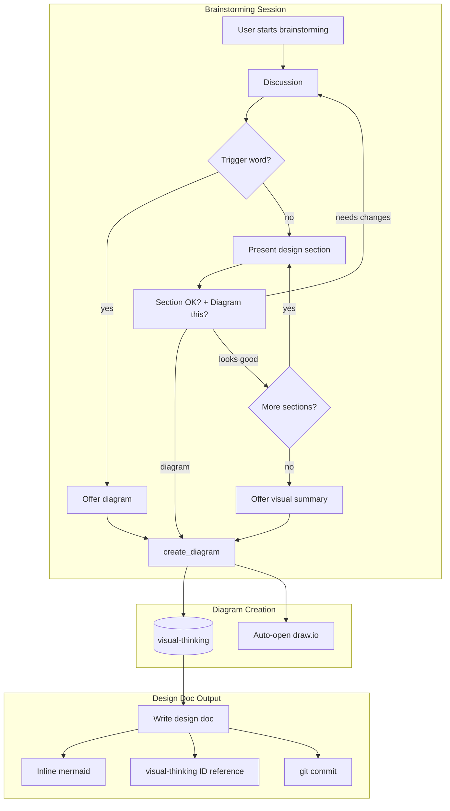

# Brainstorming + Visual Thinking Integration

## Overview

Integrate visual-thinking diagrams into the superpowers brainstorming workflow. Auto-suggest diagrams during design discussions and embed them in design documents with edit capabilities.

## Architecture

<!-- Diagram: Brainstorming + Visual Thinking Integration -->
<!-- visual-thinking-id: 4a13d2bd-c2c5-4cb9-8741-7265f5cf2557 -->
<!-- Edit in draw.io: export_diagram(id: "4a13d2bd-c2c5-4cb9-8741-7265f5cf2557", format: "drawio") -->



## Auto-Suggest Triggers

### Trigger Words

Offer to create a diagram when discussion mentions:

- **Architecture**: architecture, components, system design
- **Flows**: flow, workflow, wireflow, data flow, pipeline
- **User journeys**: user flow, journey map, customer journey, user journey, user path
- **State**: state machine, states, transitions
- **Data**: data model, ERD, schema, relationships
- **UI**: wireframe, mockup, UI, screens
- **General**: diagram, visualize, draw

### Trigger Points

1. **During discussion** - When trigger words appear, ask: "Want me to capture this as a diagram?"

2. **After design sections** - After each 200-300 word section, offer:
   - "Looks good"
   - "Needs changes"
   - "Diagram this section"

3. **End of brainstorm** - After validating full design: "Create a visual summary of the architecture?"

## Design Doc Format

When creating design docs at `docs/plans/YYYY-MM-DD-<topic>-design.md`:

```markdown
## Section Name

<!-- Diagram: Descriptive Title -->
<!-- visual-thinking-id: uuid-here -->
<!-- Edit in draw.io: export_diagram(id: "uuid", format: "drawio") -->

\`\`\`mermaid
flowchart TB
    A --> B
\`\`\`

Section description follows...
```

### What This Provides

| Feature | Benefit |
|---------|---------|
| Inline mermaid | GitHub/GitLab renders diagram |
| visual-thinking ID | Persistent storage with version history |
| Edit instructions | One command opens in draw.io |

### Editing Workflow

1. User exports to draw.io: `export_diagram(id: "...", format: "drawio")`
2. User edits in draw.io with full shape libraries
3. User returns: "I updated the login flow diagram"
4. Claude updates both design doc and visual-thinking
5. Version history tracks the change

## Implementation

### Approach: Hook-Based Integration

**Key constraint:** brain-jar owns visual-thinking, but NOT superpowers:brainstorming. We can't modify third-party plugins.

**Solution:** Use hookify to inject diagram prompts during any brainstorming session. This keeps the UX seamless without requiring ownership of other plugins.

### Hook Configuration

Create a hookify rule in brain-jar that triggers on brainstorming context:

```yaml
name: visual-thinking-brainstorm-integration
description: Offer diagrams during brainstorming sessions
trigger:
  # Detect brainstorming skill is active or design discussion happening
  patterns:
    - "architecture"
    - "flow"
    - "workflow"
    - "wireflow"
    - "data model"
    - "state machine"
    - "user journey"
    - "wireframe"
    - "mockup"
action:
  prompt: |
    Consider offering to capture this as a diagram using visual-thinking.
    If the user is discussing architecture, flows, or UI, ask:
    "Want me to capture this as a diagram? I can create a [flowchart/sequence/mindmap]
    and open it in draw.io for you to edit."
```

### Files to Modify

| File | Change |
|------|--------|
| `brain-jar/plugins/visual-thinking/hooks/brainstorm-integration.yaml` | New hookify rule for diagram prompts |
| `brain-jar/plugins/visual-thinking/skills/capture/SKILL.md` | Enhance for mid-brainstorm invocation |

### Diagram Creation Flow

When user accepts diagram offer:

1. Determine appropriate type (flowchart, sequence, mindmap, etc.)
2. Call `create_diagram` with:
   - Title from discussion context
   - Scope: `project:<current-project>`
   - Tags: design topic, date
3. Diagram auto-opens in draw.io
4. Reference stored for design doc

### Why Hooks?

- **No plugin ownership required** - Works with any brainstorming tool
- **Seamless UX** - User doesn't need to invoke anything manually
- **Composable** - Other brain-jar plugins can add their own hooks
- **Configurable** - Users can adjust trigger words or disable

## Future Enhancement

**Native draw.io XML generation** - Currently limited to Mermaid syntax which draw.io converts. Native XML would enable:

- Direct access to Bootstrap/Material Design/iOS/Android mockup shapes
- Full styling, colors, and formatting
- True wireframe fidelity without conversion artifacts

This is tracked in shared-memory for future implementation.

## Success Criteria

- [ ] Hookify rule triggers diagram prompts during brainstorming
- [ ] Works with superpowers:brainstorming (or any brainstorming tool)
- [ ] Diagrams save to visual-thinking with proper scope/tags
- [ ] Design docs include inline mermaid + visual-thinking reference
- [ ] Edit workflow: export to draw.io, modify, update both sources
