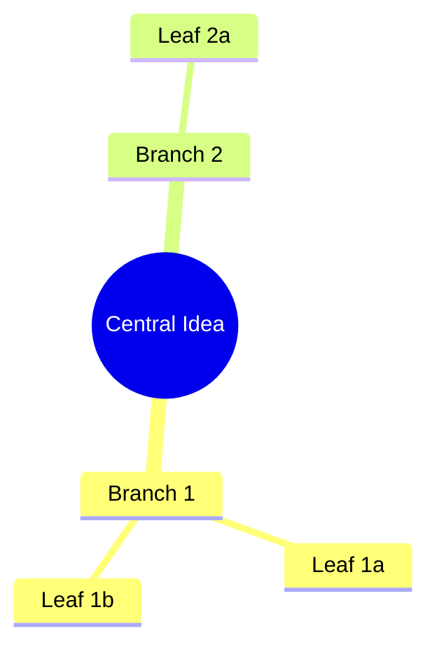
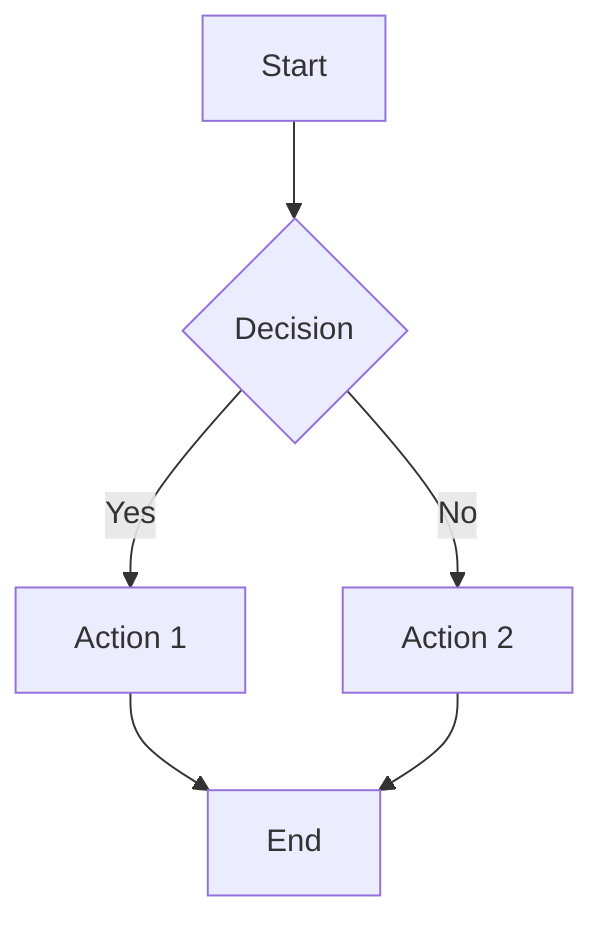
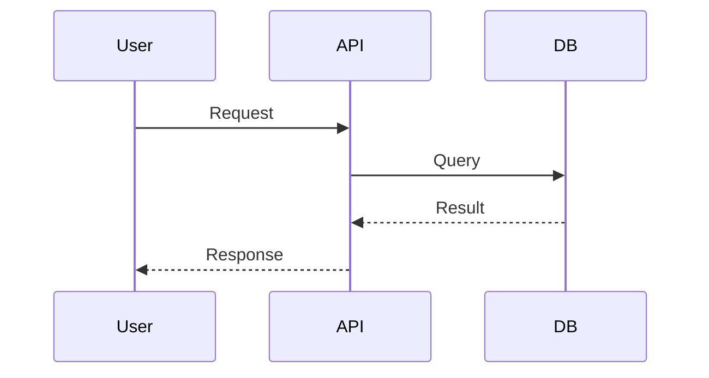
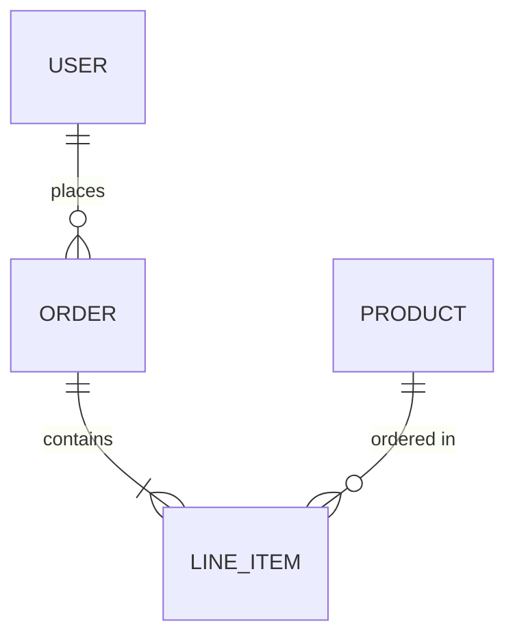

# Visual Capture

Capture complex ideas as diagrams during conversations. Diagrams persist across sessions.

## When to Use

Trigger visual capture when:
- Brainstorming ideas with many interconnected concepts
- Discussing system architecture or data flow
- Explaining a process or sequence of steps
- Mapping relationships between entities
- Documenting decisions and their dependencies

## Diagram Type Selection

Match the diagram type to what you're capturing:

| Situation | Diagram Type |
|-----------|--------------|
| Brainstorming, exploring ideas | `mindmap` |
| Process with decision points | `flowchart` |
| Interactions over time | `sequence` |
| System components and connections | `architecture` (use flowchart syntax) |
| Data models and relationships | `erd` |
| Object relationships | `classDiagram` |
| State transitions | `stateDiagram` |
| Project timeline | `gantt` |

## Creating a Diagram

1. **Identify the core concept** — What's the central idea or starting point?
2. **List key relationships** — What connects to what?
3. **Choose the right type** — Match the diagram type to the thinking pattern
4. **Write Mermaid syntax** — Keep it simple; you can always add detail later
5. **Add rich context** — Explain what this diagram represents and why

## Mermaid Quick Reference

**Mindmap** (for brainstorming):


**Flowchart** (for processes):


**Sequence** (for interactions):


**ERD** (for data models):


## Context Matters

Always provide rich context when creating diagrams:

**Bad context:**
> "Architecture diagram"

**Good context:**
> "Architecture for the real-time notification system. Shows how events flow from user actions through the event bus to connected clients. Created while brainstorming the notification feature for the mobile app project."

Context helps you (and Claude) understand the diagram's purpose when you return to it later.

## Scope Selection

- **global** — Personal thinking patterns, reusable across projects
- **project:<name>** — Specific to a project (auto-detect from working directory)

## Subagent Pattern (Optional)

For complex conversations with lots of context, optionally use a Haiku subagent to draft:

```
[Task tool with model: "haiku"]
Prompt: "Review the conversation above about [topic]. Draft a [diagram-type]
diagram capturing the key concepts discussed. Return only valid Mermaid syntax."
```

**When this helps:**
- Long brainstorming sessions with many ideas scattered across messages
- Technical discussions where the architecture emerged organically
- When you're unsure what the final structure should be

**Skip the subagent when:**
- The diagram structure is already clear in your head
- Simple diagrams with few nodes
- You're iterating on an existing diagram

The draft is a starting point—review and refine before saving.

## After Capture

Once captured, diagrams can be:
- Retrieved and modified with `get_diagram` and `update_diagram`
- Searched by content or context with `search_diagrams`
- Exported to Mermaid files or other formats with `export_diagram`
- Used as context in future conversations

## Related Skills

- **resume** — Continue working on an existing diagram
